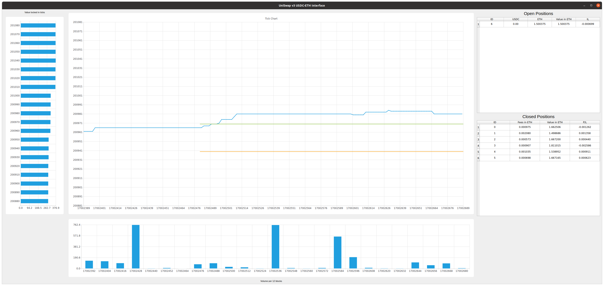
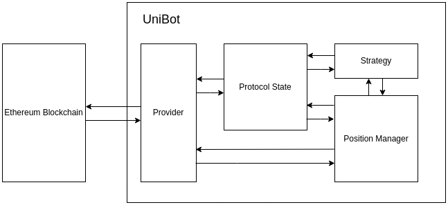

# UniStrat: A UniSwap LP strategy framework

### What is UniStrat?

UniStrat is a tool for liquidity providers in UniSwap v3. It has been shown that most LPs in Uniswap are loosing money as they are effectively selling short puts on the market (see [Guillaumes blog series](https://lambert-guillaume.medium.com/uniswap-v3-lp-tokens-as-perpetual-put-and-call-options-5b66219db827)).
Without active management and careful choosing of the liquidity positions, most LPs are destined to loose money. UniStrat tries to give LPs a way to codify and backtest their strategies.



### Get Started

First, clone the repositiory and create a new Python environment. I recommend using [Anaconda](https://www.anaconda.com/).
```bash
conda create --name unistrat -c conda-forge python=3.11
pip install -r requirements.txt
conda activate unistrat
```

Next, you need to create a `.env` file with the following two entries:
```bash
ACCOUNT_PRIVATE_KEY=<PRIVATE_KEY>
INFURA_KEY=<BLOCKCHAIN_PROVIDER_URL>
```
Replace the BLOCKCHAIN_PROVIDER_URL with the one given by your provider. I recommend using [Infura](https://www.infura.io/) as setting up is super fast and you get 100'000 API calls per day which should be plenty.

Finally, you can run the code. There are two mandatory arguments to pass in:
1. pool_address: this is the address of the UniSwap pool you want to provide liquidity to. For example, the USDC-ETH pool on mainnet has the address `0x88e6a0c2ddd26feeb64f039a2c41296fcb3f5640`
2. network: possible values are mainnet, goerli, optimism, base

Additionally, there are several options available:
| Flags      | Description |
| ----------- | ----------- |
| --gui       | runs the code with the GUI (as shown above)|
| --simulate  | runs the code on live data but without making transactions |
| --backest   | runs the code in backtesting mode |
| --from_block| specifies which block to start the backtesting |
| --to_block  | specifies which block to finish the backtesting |
| --save_performance  | saves the perforamance of the closed positions in a file |

So for example, if you want to backtest your strategy during from block 17000001 to block 17005000 and save the performance, run the following command:
```python
python3 run.py 0x88e6a0c2ddd26feeb64f039a2c41296fcb3f5640 mainnet --backtest --from_block 17000001 --to_block 17005000 --save_performance performance_17000001_17005000
```

### Structure

All the code lives in `src/` and contains the following components:

    - `provider.py`: is the interface to an Ethereum node and fetches all the relevant data
    - `protocol_state.py`: represents the current state of the UniSwap pool
    - `strategy.py`: codifies the strategy to provide liquidity
    - `position.py`: represents a UniSwap LP position
    - `position_manager.py`: manages the open and closed positions
    - `gui.py`: simple visual interface to display all relevant informations




### Limitations

- currently only works for the [USDC-ETH pool](https://etherscan.io/address/0x88e6a0c2ddd26feeb64f039a2c41296fcb3f5640#events)
- no unit tests
